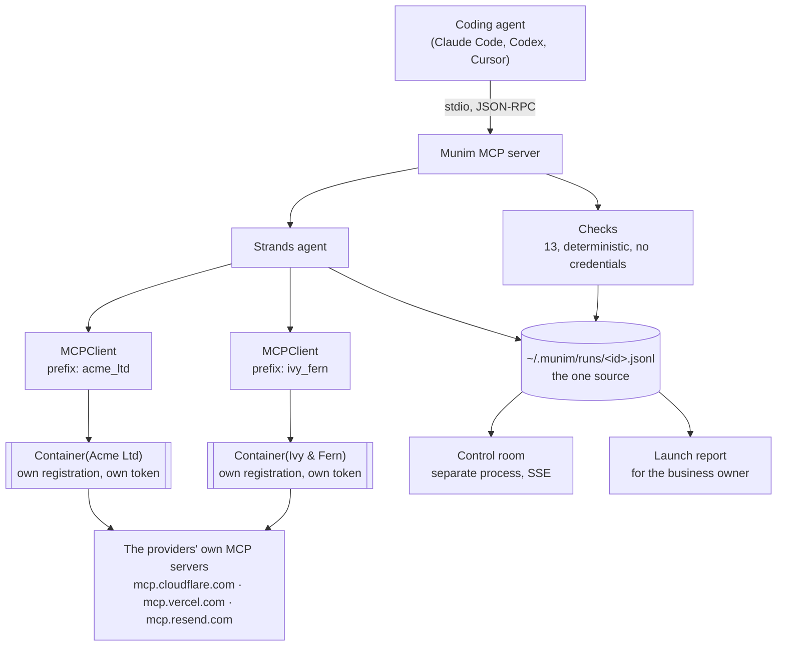

# Munim

**One MCP server holding a live session with every client's account at once.**

A coding agent can be logged in to one Cloudflare account. One Vercel. One Resend. Connect
a second client and the first one goes away. So the person looking after a dozen small
businesses runs a dozen agent sessions, and no single one of them can answer a question
about more than one client.

Munim holds them all. Each client gets its own registration with the provider, its own
token and its own namespace in the tool list, so one agent can read across every client
and write inside the one you named.

```
Kloudfirst       -> Kloudfirst@gmail.com's Account          (3 tools)
Balaji Roofings  -> Tech.bajajiroofing@gmail.com's Account  (3 tools)

both sessions opened concurrently, one process, no logout
```

That is a real run against two real Cloudflare accounts, not a diagram. Reproduce it with
your own two accounts: `scripts/cross_account_probe.py`.

### Why this is not just credential switching

The nearest prior work, [`mcpwarden`](https://github.com/ibhugeloo/mcpwarden), registers N
copies of a provider's MCP server in your coding agent, one per account, and its own
description calls them *"exclusive context profiles"*: one active at a time. That removes
the re-login and leaves the isolation. It cannot answer a question that spans two accounts,
because nothing sees across two entries in a tool list.

Isolation is the easy half. Twelve clients across four providers is 48 entries in your tool
list and still no vantage point. Munim is one entry holding 48 sessions, which is what
makes *"which of my clients has a domain expiring this quarter?"* a question you can ask.

Nothing is registered by hand. Cloudflare, Vercel and Resend each run their own MCP server
and each issues a client on demand, so connecting is a browser window and nothing else, and
there is no client secret anywhere in this repository.

---

*A munim is the steward a business owner trusts to keep their books and handle their affairs
without being asked each time.*

---

## The problem

One person maintains the web and email setup of a dozen small businesses. The clients own
the Vercel, Cloudflare and Resend accounts and pay the bills; the operator holds delegated
access and does the work.

Every provider allows one login at a time. So the operator's workaround is a separate
coding-agent session per client. Isolation built out of browser tabs and discipline.

That costs three things:

1. **Switching.** Every action on a different client means re-authenticating somewhere.
2. **No vantage point.** *"Which clients have a domain expiring this quarter?"* cannot be
   asked from anywhere, because no place can see all of them.
3. **Silent failure.** Standing up a client is a copy-paste dance between accounts, and one
   of the handoffs fails invisibly.

That last one is the reason this exists. Resend emits DKIM and SPF records that must be
written into Cloudflare. Get the A record wrong and the site does not load, and you find out
in minutes. **Get the SPF record wrong and nothing breaks**: the client's invoices quietly
stop arriving, and nobody notices for weeks.

## What it does

Adds one MCP server to whatever coding agent you use. Each client becomes a **container**:
its own registration with the provider, its own token, its own namespace in the tool list.
Nothing is registered by hand, because all three providers issue a client on demand.

- **Read across every client.** *"Whose domain expires this quarter?"*
- **Write only inside one you have named.** A mutation loads one client's credentials and
  no others.
- **Check the things nobody checks.** Not because they are hard, but because running them
  by hand on every launch for every client is not realistic. An agent does not get bored on
  check eleven.

## Install

Requires Python 3.10+.

```bash
git clone https://github.com/vishalsg42/munim && cd munim
uv venv && uv pip install -e .
claude mcp add munim -- "$(pwd)/.venv/bin/munim-mcp"
```

Set a model host in `.env` (see `.env.example`). Any Strands-supported provider works:
Amazon Bedrock, Gemini, Anthropic, OpenAI, Ollama.


```
GEMINI_API_KEY=...
```

Connect a client. Nothing is registered by hand: Cloudflare, Vercel and Resend each
run their own MCP server, and each registers a client on demand, so a browser opens
and that is the whole setup. There is no application to create and no client secret
anywhere in this project. Leave the name out and the account you sign in to supplies
it, which is what keeps a name and an account from drifting apart:

```bash
munim connect cloudflare                    # browser login; the account names the client
munim connect "Balaji Roofings" vercel      # or name it yourself
munim rename "<account name>" "Balaji Roofings"
munim merge "<account name>" "Balaji Roofings"   # if they were added twice
munim forget "<client>"                          # only when it holds nothing
munim clients                                # what is connected
munim doctor                                 # what is missing, and the fix
```

Then, in your coding agent:

```
which of my clients has a domain expiring this quarter?
check ivyandfern.co.uk for Ivy & Fern Studio
```

Open the control room to watch a run:

```bash
uv run munim-room                        # http://127.0.0.1:8977
uv run munim-room --port 8986            # if 8977 is taken
uv run munim-room --runs DIR --reports DIR   # serve a different set of runs
```

## The tools your agent gets

Eight, and this is the whole surface. Anything not listed here is not reachable, whatever
else is in the repository.

| Tool | |
|---|---|
| `list_clients` | every client and what each is connected to |
| `find_across_clients` | one deterministic question over all of them at once |
| `ask_across_clients` | one open question over all of them, using their own accounts, read-only |
| `audit_all_clients` | the whole catalogue against every client, silent when they all pass |
| `check` | the 13-check catalogue against a client or a bare domain |
| `client_status` | what is known about one client |
| `add_client` | register one |
| `connect_provider` | store a pasted key, for providers with nothing better |
| `launch_status` | read a run back |
| `plan_mail_setup` | what setting up email for a client would change, touching no DNS |
| `apply_mail_setup` | carry out a plan, with approval required to replace a record somebody put there |

Repair is the last two, and it is deliberately two calls rather than one. A tool call
returns once, so there is nowhere for a mid-flight question to go: `plan` reads what is
there and says what would change, `apply` carries out a plan the operator has seen.
Approval is the gap between them.

`apply` refuses without `approved=true` when the plan would replace or combine a record
somebody put there on purpose. Creating one that does not exist is not a judgement call;
changing one that does is, and it is someone else's live mail.

**Eight is now ten**, and the two that were missing are why: the repair code existed,
was tested, and had no caller outside its own module until an external reviewer pointed
it out. `agent/mail.py:set_up_mail` still takes a callback and is still unreachable from
MCP for that reason; `plan_mail_setup` and `apply_mail_setup` are the shape that survives
the boundary.

## What is implemented

| | State |
|---|---|
| Per-client credential containers, OS keychain | ✅ |
| Read across / write within | ✅ |
| Check catalogue, 13 checks, no credentials needed | ✅ |
| A session per client against the providers' own MCP servers | ✅ live against Cloudflare |
| Dynamic client registration, so nothing is registered by hand | ✅ Cloudflare, Vercel, Resend |
| Client named by the account it was authorised as | ✅ |
| Strands agent holding every client's provider tools, namespaced | ✅ |
| Cross-client questions, writes structurally absent | ✅ `ask_across_clients` |
| Run log with replay | ✅ open the room mid-run, or refresh, and the whole run replays |
| Resuming an interrupted launch from the log | ⬜ not implemented |
| Control room, live over SSE | ✅ |
| Launch report for the business owner | ✅ |
| OAuth connect (PKCE), issuer validated per RFC 9207 | ✅ Vercel live against two real accounts |
| Two accounts on one provider at once | ◐ registration proven; second sign-in not yet run |
| Cloudflare DNS writes: idempotent upsert, SPF merge | ✅ tested, including partial-failure behaviour; not yet run against a live zone |
| Vercel reads: deploys, env scope, env applied | ✅ live |
| Resend writes: create and verify a sender domain | ✅ |
| Vercel write operations | ⬜ not yet |

Re-running a launch after a partial failure does not duplicate anything, which
is the property people usually mean by resume: every write reads what is there
first and updates in place, and the SPF merge removes the leftovers before
writing so a failure part-way leaves one working policy rather than two that
receivers ignore. Picking a launch up from where it stopped is a different
thing, and it is not built.

### Why there is no AgentCore deployment

Worth stating rather than leaving as a gap. Bedrock is unreachable on the
development account: AWS Marketplace cannot complete a model subscription for
AISPL (India) customers, because RBI rules prevent it storing card details, and
Bedrock model access is provisioned as a Marketplace subscription. Separately,
AgentCore Runtime quota defaults to zero and increases take several days.

Strands is model-portable, so the agent runs on a different host with one
environment variable changed and no code change. That is the property AWS
advertises; this exercised it under duress. Restoring Bedrock is
`MUNIM_BEDROCK_MODEL` and nothing else.

**Nothing here is stubbed.** A capability that is not implemented is absent from the tool
list rather than present and inert. Resend, for example, has no OAuth flow anywhere in this
codebase because Resend publishes no authorization endpoint, not because it was skipped.

## How it is built



Two clients, one provider, one process. That is the whole thing, and it is not
engineered: each client registers separately with the provider, so as far as the
provider is concerned they are two applications and there is nothing shared to
clobber. A coding agent holds one account per provider because one client id
shares one token store.

Four decisions carry the design:

**Enumeration is deterministic; only judgement is model work.** The checks decide pass or
fail from a DNS answer. The agent cannot contradict them, so it cannot invent a record or
argue a failing check into passing. What it does is the part a rule engine is bad at:
working out *why* something failed, and saying it to someone non-technical.

**The run log is the one source of truth.** The MCP server speaks JSON-RPC over stdout, so
it cannot print progress there without corrupting the protocol, and the subprocess dies
whenever the coding agent reconnects. Writing events to a file instead means the control
room survives a restart, can be opened mid-run with full replay, and an interrupted launch
leaves a record to resume from.

**A container is bound to one client at construction and cannot widen.** `"acme"` versus
`"acme-uk"` would otherwise be a *successful* mutation on the wrong account. Container
construction fails on an unregistered name, and the raw credential is never returned to
calling code: a session carries its own registration and its own token, filed under
`(client, provider)`, so two clients cannot borrow each other's. Where an adapter is used
instead it receives an authenticated HTTP client, so no log line or stack trace can leak a
token.

**Read across, write within is a property of which tools exist.** A tool that spans clients
is built from only those the provider marks `readOnlyHint`, default deny, so one that
changes something is not present to be called. It used to be a line in a system prompt, and
an instruction is not a boundary.

## Roadmap

Written down because the gaps are known, not because they are planned away.

**Linux and Windows.** Developed on macOS and the platform assumptions have
been found rather than guessed at. `doctor` now reports whether a keychain
backend exists instead of raising, credential reads degrade to "nothing
connected" rather than a stack trace, and the `claude` executable is resolved
through `shutil.which` because on Windows it is `claude.cmd`. What remains
untested is a real run on either: a headless Linux box needs `keyrings.alt` or
a secret service, and nobody has yet confirmed the browser callback and the
keychain behave there. CI runs the suite on Linux, which is a start and not the
same thing.

**Watch mode.** `audit_all_clients` is the shape of it and runs on demand.
Running on a schedule and telling somebody only when the answer changes is the
version an operator would actually leave on.

**Vercel and Resend sessions.** Registration is confirmed against all three
providers, and only Cloudflare has been connected and used. The other two are
expected to work and that is not the same as knowing.

**Resuming an interrupted launch.** The run log records enough to do it and
nothing reads it back for that purpose.

## Development

```bash
uv pip install -e ".[dev]"
uv run pytest -q                              # the Python suite
cd room && npx tsx --test src/state.test.ts   # the room's reducer
cd room && npm install && npm run build
```

The control room ships pre-built, so installing from a clone needs no npm step.
Rebuild it only if you change `room/src`.

To check the claim this project rests on, which is reading two client accounts
at once with no logout between them, connect two of your own and run:

```bash
uv run python scripts/cross_account_probe.py
```

It fails if either account is empty, and fails if the two share a project: two
grants returning the same projects are one account wearing two names, which
would make the claim vacuous. Measured on two real Vercel teams in
[`docs/DECISIONS.md`](docs/DECISIONS.md) D23.

Design decisions and the reasoning behind them are in [`docs/DECISIONS.md`](docs/DECISIONS.md),
including the ones that were wrong first time.

## Disclosure

Built with AI assistance (Claude Code), which the hackathon rules permit. No pre-existing
code was incorporated; the repository was created during the submission period. Prior
personal projects informed the working method but contributed no source.

## Licence

MIT. See [LICENSE](LICENSE).
