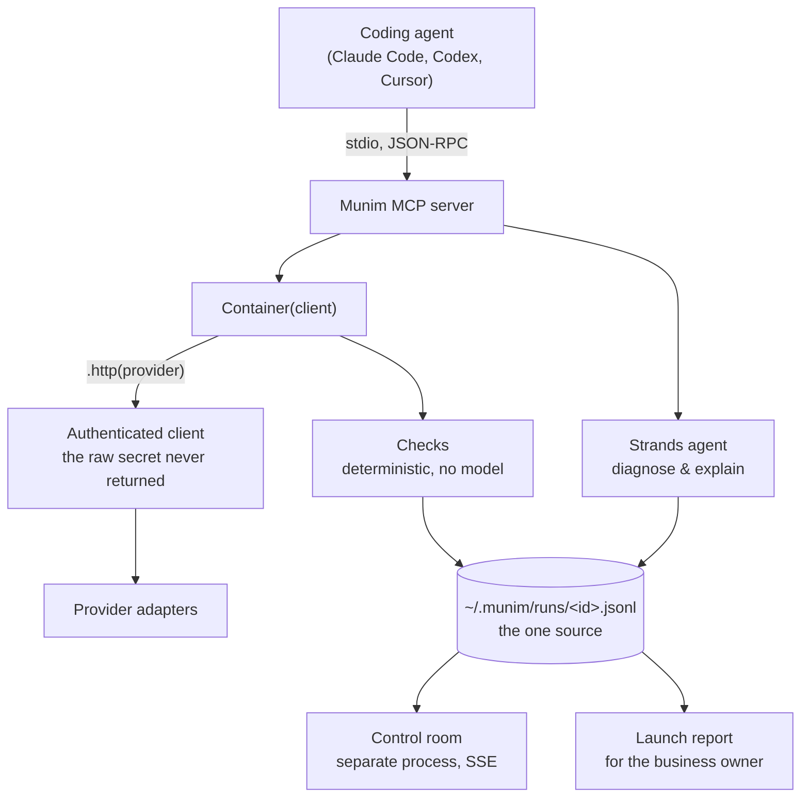

# Munim

**A multi-account MCP server for people who look after other people's infrastructure.**

A *munim* is the steward a business owner trusts to keep their books and handle their
affairs without being asked each time. That is what this does for a dozen small
businesses at once.

---

## The problem

One person maintains the web and email setup of a dozen small businesses. The clients own
the Vercel, Cloudflare and Resend accounts and pay the bills; the operator holds delegated
access and does the work.

Every provider allows one login at a time. So the operator's workaround is a separate
coding-agent session per client. Isolation built out of browser tabs and discipline.

That costs three things:

1. **Switching.** Every action on a different client means re-authenticating somewhere.
2. **No vantage point.** *"Which clients have a domain expiring this quarter?"* cannot be
   asked from anywhere, because no place can see all of them.
3. **Silent failure.** Standing up a client is a copy-paste dance between accounts, and one
   of the handoffs fails invisibly.

That last one is the reason this exists. Resend emits DKIM and SPF records that must be
written into Cloudflare. Get the A record wrong and the site does not load, and you find out
in minutes. **Get the SPF record wrong and nothing breaks**: the client's invoices quietly
stop arriving, and nobody notices for weeks.

## What it does

Adds one MCP server to whatever coding agent you use. Each client becomes a **container**
holding only that client's credentials.

- **Read across every client.** *"Whose domain expires this quarter?"*
- **Write only inside one you have named.** A mutation loads one client's credentials and
  no others.
- **Check the things nobody checks.** Not because they are hard, but because running them
  by hand on every launch for every client is not realistic. An agent does not get bored on
  check eleven.

## Install

Requires Python 3.10+.

```bash
git clone https://github.com/vishalsg42/munim && cd munim
uv venv && uv pip install -e .
claude mcp add munim -- "$(pwd)/.venv/bin/munim-mcp"
```

Set a model host in `.env` (see `.env.example`). Any Strands-supported provider works:
Amazon Bedrock, Gemini, Anthropic, OpenAI, Ollama.


```
GEMINI_API_KEY=...
```

Connect a client. Where a provider publishes an OAuth flow this opens a browser
and no secret ever passes through your coding agent; where it does not, you paste
a key once and it goes straight to your keychain:

```bash
munim connect "Balaji Roofings" vercel      # browser login
munim connect "Balaji Roofings" resend      # Resend has no OAuth; key only
munim clients                                # what is connected
munim doctor                                 # what is missing, and the fix
```

Then, in your coding agent:

```
which of my clients has a domain expiring this quarter?
check ivyandfern.co.uk for Ivy & Fern Studio
```

Open the control room to watch a run:

```bash
uv run munim-room                        # http://127.0.0.1:8977
uv run munim-room --port 8986            # if 8977 is taken
uv run munim-room --runs ~/.munim/runs   # serve a different set of runs
```

## What is implemented

| | State |
|---|---|
| Per-client credential containers, OS keychain | ✅ |
| Read across / write within | ✅ |
| Check catalogue, 13 checks, no credentials needed | ✅ |
| Strands launch agent: diagnosis and owner-facing explanation | ✅ |
| Run log with replay and resume | ✅ |
| Control room, live over SSE | ✅ |
| Launch report for the business owner | ✅ |
| OAuth connect (PKCE) | ✅ built; needs a provider client ID |
| Cloudflare DNS writes: idempotent upsert, SPF merge | ✅ tested against documented shapes; not yet probed live |
| Vercel reads: deploys, env scope, env applied | ✅ |
| Vercel / Resend write operations | ⬜ not yet |

### Why there is no AgentCore deployment

Worth stating rather than leaving as a gap. Bedrock is unreachable on the
development account: AWS Marketplace cannot complete a model subscription for
AISPL (India) customers, because RBI rules prevent it storing card details, and
Bedrock model access is provisioned as a Marketplace subscription. Separately,
AgentCore Runtime quota defaults to zero and increases take several days.

Strands is model-portable, so the agent runs on a different host with one
environment variable changed and no code change. That is the property AWS
advertises; this exercised it under duress. Restoring Bedrock is
`MUNIM_BEDROCK_MODEL` and nothing else.

**Nothing here is stubbed.** A capability that is not implemented is absent from the tool
list rather than present and inert. Resend, for example, has no OAuth flow anywhere in this
codebase because Resend publishes no authorization endpoint, not because it was skipped.

## How it is built



Three decisions carry the design:

**Enumeration is deterministic; only judgement is model work.** The checks decide pass or
fail from a DNS answer. The agent cannot contradict them, so it cannot invent a record or
argue a failing check into passing. What it does is the part a rule engine is bad at:
working out *why* something failed, and saying it to someone non-technical.

**The run log is the one source of truth.** The MCP server speaks JSON-RPC over stdout, so
it cannot print progress there without corrupting the protocol, and the subprocess dies
whenever the coding agent reconnects. Writing events to a file instead means the control
room survives a restart, can be opened mid-run with full replay, and an interrupted launch
leaves a record to resume from.

**A container is bound to one client at construction and cannot widen.** `"acme"` versus
`"acme-uk"` would otherwise be a *successful* mutation on the wrong account. Container
construction fails on an unregistered name, and the raw credential is never returned to
calling code. Adapters receive an authenticated HTTP client, so no log line or stack trace
can leak a token.

## Development

```bash
uv pip install -e ".[dev]"
uv run pytest -q                          # 115 tests
cd room && npx tsx --test src/state.test.ts   # 5 more, the room's reducer
cd room && npm install && npm run build
```

The control room ships pre-built, so installing from a clone needs no npm step.
Rebuild it only if you change `room/src`.

To check the claim this project rests on, which is reading two client accounts
at once with no logout between them, connect two of your own and run:

```bash
uv run python scripts/cross_account_probe.py
```

It fails if either account is empty, and fails if the two share a project: two
grants returning the same projects are one account wearing two names, which
would make the claim vacuous. Measured on two real Vercel teams in
[`docs/DECISIONS.md`](docs/DECISIONS.md) D23.

Design decisions and the reasoning behind them are in [`docs/DECISIONS.md`](docs/DECISIONS.md),
including the ones that were wrong first time.

## Disclosure

Built with AI assistance (Claude Code), which the hackathon rules permit. No pre-existing
code was incorporated; the repository was created during the submission period. Prior
personal projects informed the working method but contributed no source.

## Licence

MIT. See [LICENSE](LICENSE).
