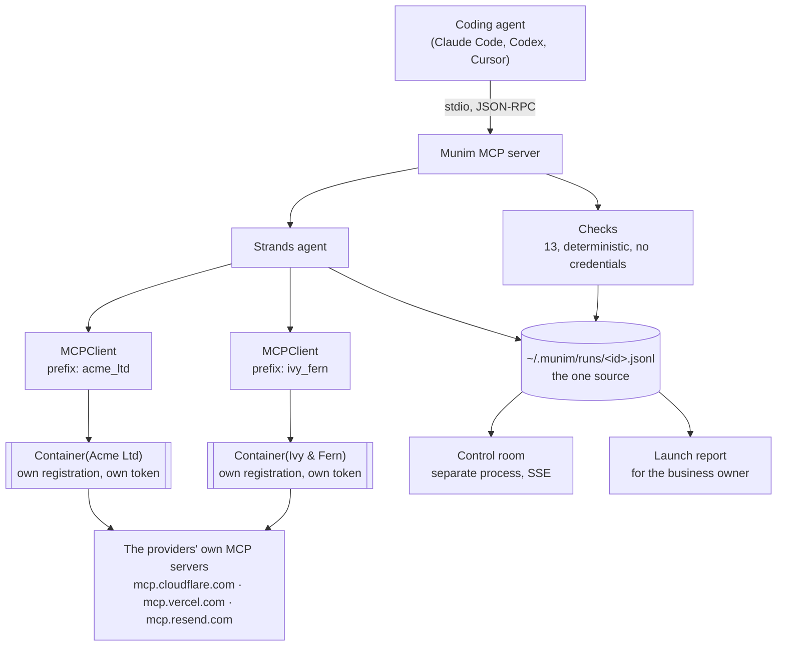

# How Munim is built

The README says what it does. This says how, and why it is shaped this way.
The reasoning behind individual calls, including the ones that were wrong the
first time, is in [`DECISIONS.md`](DECISIONS.md).

Two clients, one provider, one process. That is the whole thing, and it is not
engineered: each client registers separately with the provider, so as far as the
provider is concerned they are two applications and there is nothing shared to
clobber. A coding agent holds one account per provider because one client id
shares one token store.

## Four decisions carry the design

**Enumeration is deterministic; only judgement is model work.** The checks decide
pass or fail from a DNS answer. The agent cannot contradict them, so it cannot
invent a record or argue a failing check into passing. What it does is the part a
rule engine is bad at: working out *why* something failed, and saying it to
someone non-technical.

**The run log is the one source of truth.** The MCP server speaks JSON-RPC over
stdout, so it cannot print progress there without corrupting the protocol, and
the subprocess dies whenever the coding agent reconnects. Writing events to a
file instead means the control room survives a restart, can be opened mid-run
with full replay, and an interrupted launch leaves a record to resume from.

**A container is bound to one client at construction and cannot widen.** `"acme"`
versus `"acme-uk"` would otherwise be a *successful* mutation on the wrong
account. Container construction fails on an unregistered name, and the raw
credential is never returned to calling code: a session carries its own
registration and its own token, filed under `(client, provider)`, so two clients
cannot borrow each other's. Where an adapter is used instead it receives an
authenticated HTTP client, so no log line or stack trace can leak a token.

**Read across, write within is a property of which tools exist.** A tool that
spans clients is built from only those the provider marks `readOnlyHint`, default
deny, so one that changes something is not present to be called. It used to be a
line in a system prompt, and an instruction is not a boundary.

## Identity is an id, not a name

Credentials are filed under a client id (`c_<hex>`) that never changes. The name
is a label for display, and renaming a client cannot orphan a session.

This was not free. Three separate bugs came from conflating the two: a registry
that minted a fresh id on every read and scattered 36 copies of one live
credential; a connect path that stored tokens under the label while storing the
account marker under the id; and a consent screen that named the application
after the id, removing the one check a person can actually perform. All three are
fixed and tested, and the tests exist because the bugs did.

## Why there is no AgentCore deployment

Worth stating rather than leaving as a gap. Bedrock is unreachable on the
development account: AWS Marketplace cannot complete a model subscription for
AISPL (India) customers, because RBI rules prevent it storing card details, and
Bedrock model access is provisioned as a Marketplace subscription. Separately,
AgentCore Runtime quota defaults to zero and increases take several days.

Strands is model-portable, so the agent runs on a different host with one
environment variable changed and no code change. That is the property AWS
advertises; this exercised it under duress. Restoring Bedrock is
`MUNIM_BEDROCK_MODEL` and nothing else.

## Nothing is stubbed

A capability that is not implemented is absent from the tool list rather than
present and inert. Resend, for example, has no OAuth flow anywhere in this
codebase because Resend publishes no authorization endpoint, not because it was
skipped.
